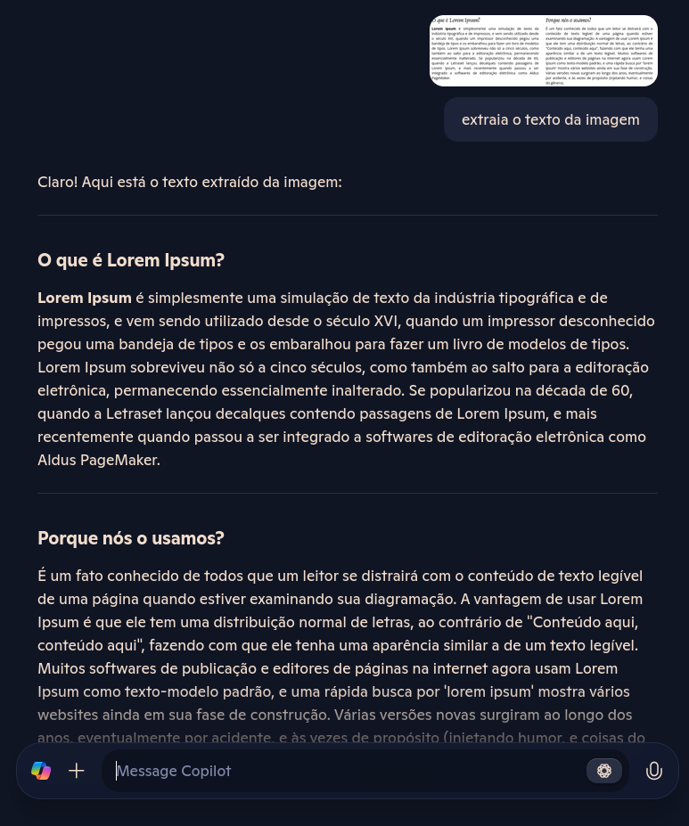

# dio-lab3-ai-900
Utilizando o Copilot para extração de textos em imagens.

---

Com a utilização de ferramentas de IA podemos aumentar a produtividade em tarefas repetivas ou que exigem extração de dados, ou conversão de imagens para texto. Além de diversas outras vantagens para produtividade, pesquisa, busca de conhecimento e automações em geral.

